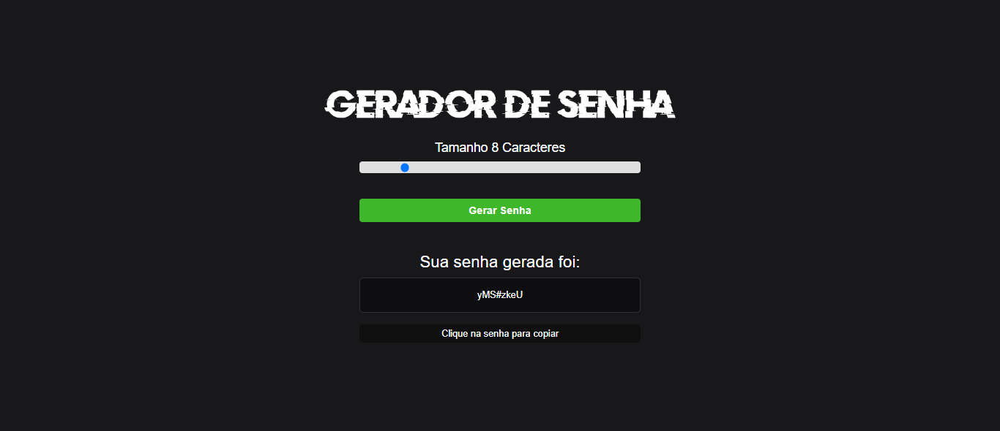
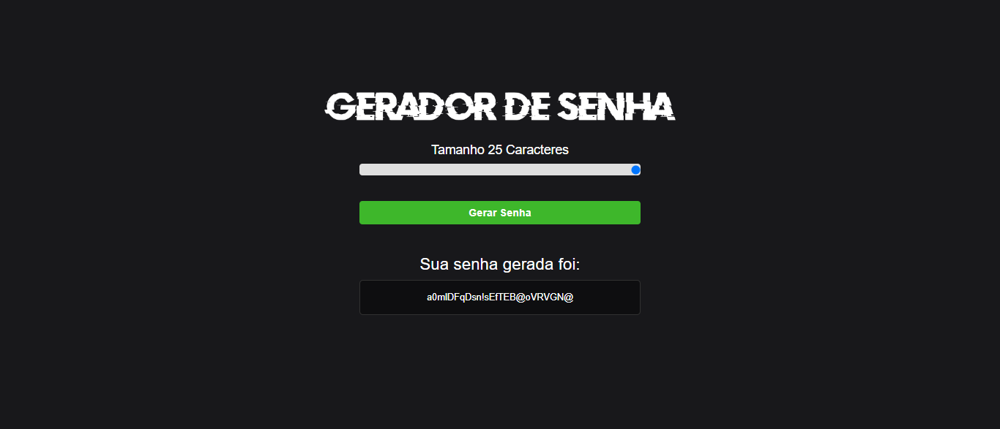
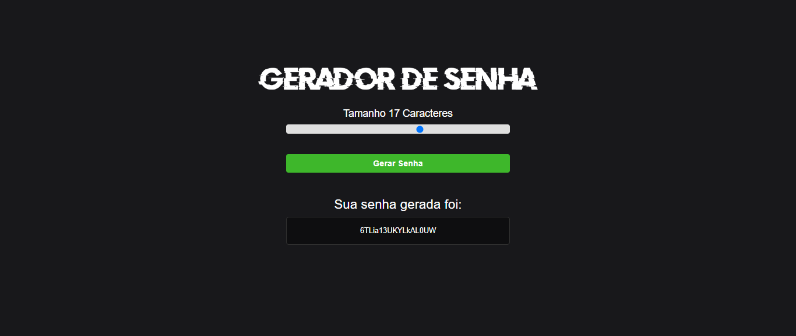

<h1> Projeto Gerador de Senhas </h1>
 
 
<h2>O projeto que desenvolvi é um gerador de senhas aleatórias que oferece aos usuários uma maneira simples e eficaz de criar senhas seguras para proteger suas contas online, arquivos importantes e informações confidenciais. Com uma interface intuitiva e funcionalidades flexíveis, o gerador permite que os usuários personalizem o comprimento da senha de acordo com suas necessidades específicas.     
Recursos Principais:   
  
Personalização do Comprimento da Senha: Os usuários têm a liberdade de escolher o comprimento desejado para suas senhas, variando de 5 a 25 caracteres. Isso permite que eles criem senhas que atendam aos requisitos de segurança de diferentes serviços online ou sistemas.

Visualização Instantânea da Senha Gerada: Após a geração, a senha aleatória é exibida instantaneamente na tela, permitindo que os usuários a visualizem e avaliem sua complexidade antes de usá-la. Isso ajuda a garantir que os usuários estejam satisfeitos com a senha gerada antes de copiá-la para uso.

Opção de Copiar a Senha: Os usuários podem copiar facilmente a senha gerada para a área de transferência do dispositivo, clicando em um botão de "Copiar". Isso oferece conveniência adicional, permitindo que os usuários cole a senha diretamente nos campos de senha dos serviços online que estão usando.

Design Responsivo e Atraente: O gerador de senhas é projetado com uma interface limpa e amigável ao usuário, utilizando CSS para estilizar os elementos e garantir uma experiência visualmente agradável. Além disso, o design responsivo permite que o gerador seja acessado e utilizado de forma eficaz em uma variedade de dispositivos, desde desktops até smartphones.

Tecnologias Utilizadas:

HTML5: Utilizado para criar a estrutura da página web e os elementos do formulário de entrada e saída.

CSS3: Responsável pelo estilo e layout do gerador de senhas, garantindo uma apresentação visual atraente e uma experiência de usuário intuitiva.

JavaScript: Implementa a lógica do gerador de senhas, gerando senhas aleatórias com base nas preferências do usuário e fornecendo funcionalidades interativas, como copiar a senha para a área de transferência.

Conclusão:

O gerador de senhas aleatórias que desenvolvi oferece uma solução eficiente e confiável para criar senhas seguras de forma rápida e conveniente. Com uma interface simples e personalizável, os usuários podem gerar senhas fortes que atendam às suas necessidades de segurança, protegendo efetivamente suas contas e informações online contra acessos não autorizados.

</a> </h2>
   
 
  <h3> Tecnologias Utilizadas </h3>
     
    
    
  
 

